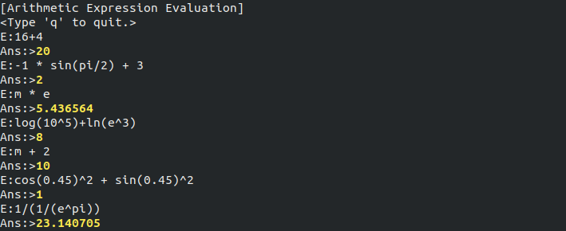

# arithmetic-evaluator
An arithmetic expression evaluation program.

Functions:
| Syntax                              | Description                        |
|-------------------------------------|------------------------------------|
| sin() cos() tan() cot()             | Core trigonometric functions       |
| arcsin() arccos() arctan() arccot() | Inverse of trigonometric functions |
| sqrt()                              | Square root                        |
Constants:
| Symbol                              | Description                        |
|-------------------------------------|------------------------------------|
| e             | euler number      |
| pi | pi number |
| m                              | (memory) former answer                        |

To compile and run:

    gcc arthm.c -o eval -lm
    

